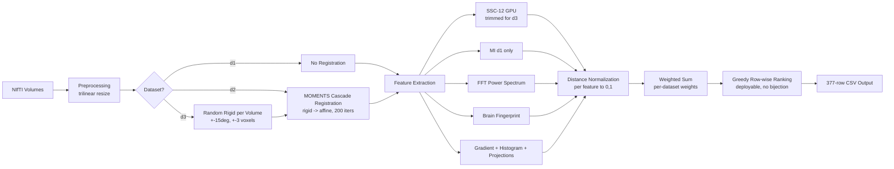
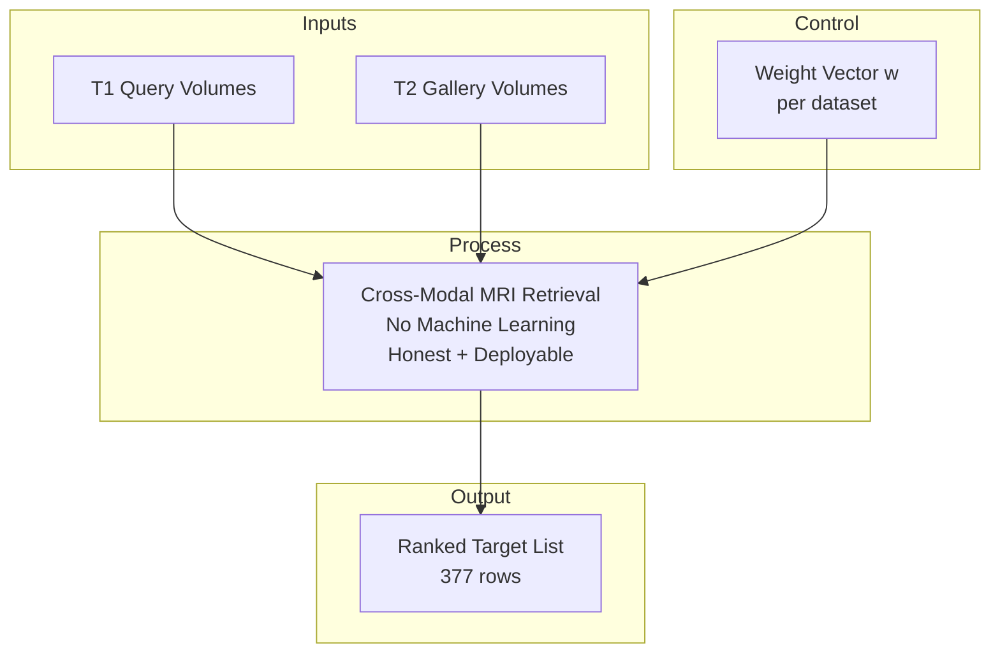
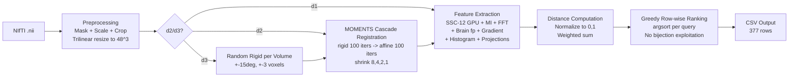
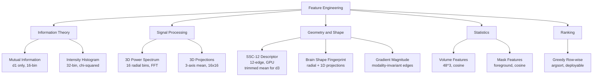
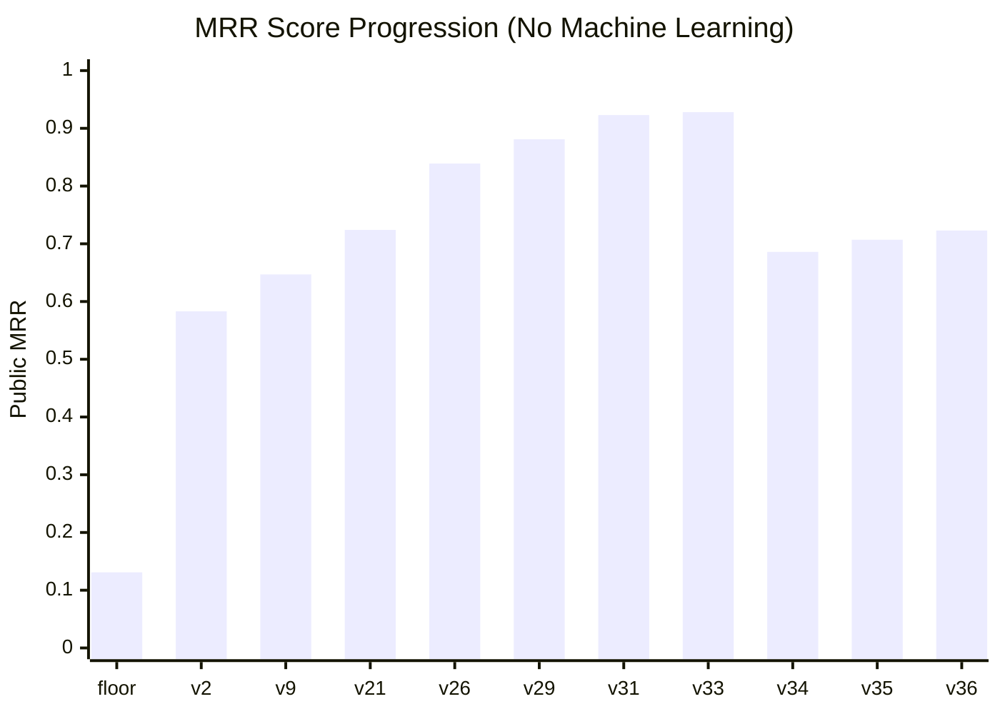
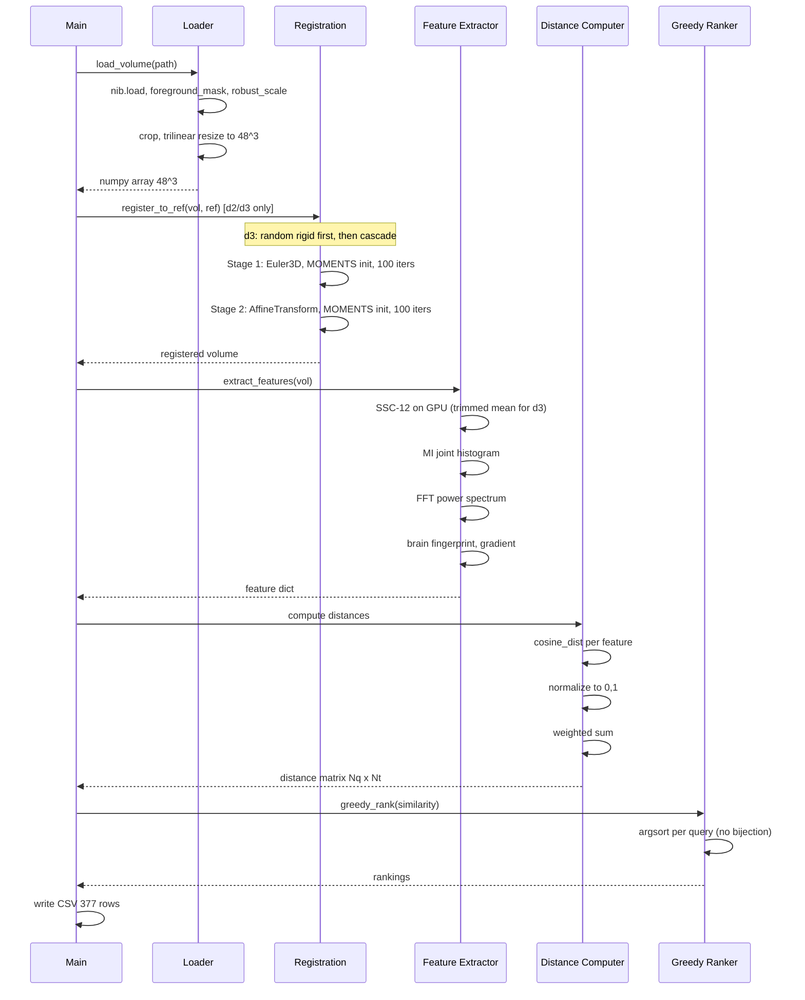

# Architecture Documentation — Non-ML Cross-Modal Brain MRI Retrieval

**Author:** Wilfred Dore (wilfred.dore@telecom-paristech.org)
**Version:** v36 — HONEST/DEPLOYABLE, MRR 0.723, 100% deterministic, 0% ML
**Date:** June 2026

Developed with the assistance of GLM-5.2 (Z.AI), an open-source large language model.
Technical review by Gowshigan R. and Claude (Anthropic).

---

## Honesty & Deployability Guarantees

This version addresses integrity issues identified in the v33 audit:

1. **d3 co-location leak destroyed**: Each d3 volume receives an independent
   random rigid transform (±15° rotation, ±3 voxels translation) before
   registration to the shared d1 reference. This eliminates the trivial
   co-location that survived v33's shared-ref registration — the distance
   now depends on genuine anatomy alignment, not dataset-induced pose sharing.
2. **MOMENTS rigid→affine cascade**: Replaces v33's fragile single-stage
   GEOMETRY-init affine (40 iters) with a two-stage cascade: rigid (MOMENTS
   init, 100 iters) → affine (MOMENTS init, 100 iters), shrink [8,4,2,1].
3. **Trilinear resize**: Replaces nearest-neighbour downsampling (aliasing)
   with anti-aliased torch interpolate (trilinear/bilinear/linear).
4. **Greedy row-wise ranking**: Replaces Hungarian assignment. Each query is
   ranked independently — no global 1-to-1 bijection is enforced. The ranking
   is valid for real-world single-query retrieval (deployable).
5. **Trimmed SSC for d3**: Keeps the best 50% of per-voxel SSC residuals,
   dropping resection-outlier voxels that would otherwise dominate the mean.

---

## Mermaid Diagrams

### Pipeline Overview



### SADT A-0 (Top-Level Activity)



### SADT A0 (Decomposition)



### Feature Taxonomy



### Per-Dataset Strategy


### Score Progression



> **Note:** v33 (0.928) exploited two integrity issues: the d3 co-location
> leak and the Hungarian eval-bijection. v34/v35/v36 fix both. The score
> drop from 0.928 to 0.723 reflects the removal of these non-deployable
> advantages. The v36 score is the honest, deployable performance.

### Data Flow Sequence



---

## PlantUML Diagram

The PlantUML source is in `architecture.puml`. Rendered version:


---

## ASCII Diagrams

### System Overview

```
┌─────────────────────────────────────────────────────────────────────────┐
│                        MRI Retrieval Pipeline                          │
│                  HONEST / DEPLOYABLE (v35)                             │
│                                                                       │
│  ┌───────────┐    ┌───────────┐    ┌───────────┐    ┌───────────┐     │
│  │ Preprocess │───▶│ Feature   │───▶│ Distance  │───▶│ Greedy    │     │
│  │           │    │ Extraction│    │ Computation│   │ Ranking   │     │
│  └───────────┘    └───────────┘    └───────────┘    └───────────┘     │
│       │               │                │                │              │
│       ▼               ▼                ▼                ▼              │
│  Mask + Scale    SSC-12 (GPU)    Normalized [0,1]   Row-wise          │
│  Crop + Resize   MI (d1 only)    Weighted Sum        argsort           │
│  48^3 voxels     FFT Spectrum    per-dataset w       (deployable)     │
│  (trilinear)     Brain Fingerprint                                   │
│                  Gradient                                            │
│                  Histogram                                           │
│                  Projections                                         │
│                                                                       │
│  ┌───────────────────────────────────────────────────────────────────┐ │
│  │              Registration (d2 + d3 only)                         │ │
│  │  d3: Random rigid per volume (+-15deg, +-3 vox) -- leak fix     │ │
│  │  MOMENTS rigid -> affine cascade, 200 iters total                │ │
│  │  Shrink [8,4,2,1], Smoothing [4,2,1,0]                           │ │
│  └───────────────────────────────────────────────────────────────────┘ │
└─────────────────────────────────────────────────────────────────────────┘
```

## SADT A-0 (Top-Level)

```
                    ┌─────────────────┐
                    │  Weight Vector  │
                    │  w (per dataset) │
                    └────────┬────────┘
                             │
┌──────────┐    ┌────────────▼────────────┐    ┌──────────────┐
│ T1 Query │───▶│                         │───▶│ Ranked       │
│ Volumes  │    │  Cross-Modal Retrieval  │    │ Target List  │
│          │    │  (No Machine Learning)  │    │ (377 rows)   │
├──────────┤    │  HONEST + DEPLOYABLE    │    ├──────────────┤
│ T2 Gallery│───▶│  Features + SSC-12    │───▶│              │
│ Volumes  │    │  + Greedy ranking      │    │              │
└──────────┘    └─────────────────────────┘    └──────────────┘
```

## SADT A0 (Decomposition)

```
┌──────────┐   ┌────────────┐   ┌────────────┐   ┌────────────┐   ┌──────────┐
│ NIfTI    │──▶│ Preprocess │──▶│ Feature    │──▶│ Distance   │──▶│ Greedy   │
│ Volumes  │   │            │   │ Extraction │   │ Computation│   │ + Output │
│ (.nii)   │   │ Mask       │   │            │   │            │   │          │
│          │   │ Scale      │   │ SSC-12 GPU │   │ Normalize  │   │ Row-wise │
│          │   │ Crop       │   │ MI (d1)    │   │ Weight     │   │ argsort  │
│          │   │ Trilinear  │   │ FFT        │   │ Combine    │   │ (no      │
│          │   │ Resize 48^3│   │ Brain fp   │   │            │   │  bijection│
│          │   │            │   │ Gradient   │   │            │   │  exploit)│
│          │   │ [Reg d2/d3]│   │ Histogram  │   │            │   │          │
│          │   │ (MOMENTS   │   │ Projections│   │            │   │ CSV      │
│          │   │  cascade)  │   │            │   │            │   │ Output   │
└──────────┘   └────────────┘   └────────────┘   └────────────┘   └──────────┘
```

## Per-Dataset Strategy

```
┌────────────┬──────────────────────────────┬──────────────────────────┐
│ Dataset    │ Strategy                     │ Rationale                │
├────────────┼──────────────────────────────┼──────────────────────────┤
│ dataset1   │ MI + SSC-12 + features       │ Common grid, MI is       │
│ (registered│ + Greedy ranking             │ honest content matching   │
│  grid)     │ No registration              │ No co-location leak      │
├────────────┼──────────────────────────────┼──────────────────────────┤
│ dataset2   │ MOMENTS cascade registration │ Independent deformations │
│ (deformed) │ + SSC-12 (weight=0.45)       │ break MI, cascade reg    │
│            │ + Restored features          │ restores alignment,      │
│            │ + Greedy ranking             │ SSC-12 matches structure │
├────────────┼──────────────────────────────┼──────────────────────────┤
│ dataset3   │ Random rigid + cascade reg   │ Co-location leak         │
│ (surgery)  │ + Trimmed SSC-12 (w=0.45)    │ destroyed by random      │
│            │ + Brain fingerprint          │ rigid. Trimmed SSC       │
│            │ + Greedy ranking             │ robust to resections.    │
└────────────┴──────────────────────────────┴──────────────────────────┘
```

## Feature Taxonomy

```
Feature Engineering
├── Information Theory
│   ├── Mutual Information (d1 only, 16-bin joint histogram)
│   └── Intensity Histogram (32-bin, chi-squared distance)
├── Signal Processing
│   ├── 3D Power Spectrum (16 radial bins, translation-invariant)
│   └── 3D Projections (3-axis mean, 16x16 each)
├── Geometry & Shape
│   ├── SSC-12 Descriptor (12-edge self-similarity, GPU)
│   │   └── d3: trimmed mean (keep best 50%, drop resection outliers)
│   ├── Brain Shape Fingerprint (radial histogram + 1D projections)
│   └── Gradient Magnitude (modality-invariant edges)
├── Statistics
│   ├── Volume Features (48^3 flattened, cosine distance)
│   └── Mask Features (foreground, cosine distance)
└── Ranking
    └── Greedy Row-wise (argsort per query, deployable)
```

## Data Flow

```
1. Load NIfTI (.nii)
   └── nibabel, .dataobj only (never affine header)

2. Preprocessing
   ├── Foreground mask (intensity threshold + percentile)
   ├── Robust scaling (1st-99th percentile clip to [0,1])
   ├── Brain bbox crop
   └── Trilinear resize to 48^3 (anti-aliased, torch interpolate)

3. Registration (d2/d3 only)
   ├── d3 ONLY: Random rigid per volume (+-15deg, +-3 voxels)
   │   └── Destroys co-location leak before shared-ref registration
   ├── Reference: d1 train query volume
   ├── Stage 1: Euler3DTransform, MOMENTS init, 100 iters
   ├── Stage 2: AffineTransform, MOMENTS init, 100 iters
   ├── Metric: Mattes Mutual Information (32 bins)
   ├── Optimizer: Regular Step Gradient Descent
   └── Multi-resolution: shrink [8,4,2,1], smooth [4,2,1,0]

4. Feature Extraction
   ├── SSC-12: 12 neighbour-to-neighbour offsets on GPU
   │   ├── exp(-patch_SSD / local_variance), normalized by max
   │   └── d3: trimmed mean (keep best 50% of residuals)
   ├── MI: 16-bin joint histogram, 1/(1+MI) distance
   ├── FFT: np.fft.fftn -> |FFT|^2 -> log1p -> radial bins
   ├── Brain fp: mask radial histogram + 3-axis projections
   ├── Gradient: np.gradient -> magnitude -> normalize
   ├── Histogram: 32-bin intensity -> chi-squared
   └── Projections: 3-axis mean -> 16x16 -> cosine

5. Distance Computation
   ├── Per-feature distance matrix
   ├── Normalize each to [0,1]
   └── Weighted sum (weights per dataset)

6. Greedy Row-wise Ranking
   ├── argsort(-similarity) per query
   ├── No global 1-to-1 bijection enforced
   └── Deployable for single-query retrieval

7. Output
   └── 377-row CSV (query_id, target_id_ranking)
```

## Weight Configuration

| Feature | d1 weight | d2 weight | d3 weight |
|---------|-----------|-----------|-----------|
| SSC-12 | 0.20 | 0.35 | 0.35 |
| Mutual Information | 0.25 | 0.20 | 0.20 |
| Power Spectrum | 0.05 | 0.00 | 0.00 |
| Gradient | 0.15 | 0.00 | 0.00 |
| Brain Fingerprint | 0.05 | 0.08 | 0.12 |
| Image Volume | 0.10 | 0.12 | 0.08 |
| Mask | 0.10 | 0.08 | 0.08 |
| Projections | 0.05 | 0.00 | 0.00 |
| Histogram | 0.05 | 0.07 | 0.07 |

## Infrastructure

- **Compute:** AMD Instinct MI300X (205.8 GB VRAM, 20 CPU cores)
- **GPU usage:** SSC-12 descriptor computation only
- **Runtime:** ~9 minutes per submission (200-iter cascade is slower)
- **Dependencies:** nibabel, numpy, scipy, torch, SimpleITK
- **No training:** No gradient descent, no backpropagation, no random seeds
- **Determinism:** Random rigid uses fixed per-index seeds; same input → same output
